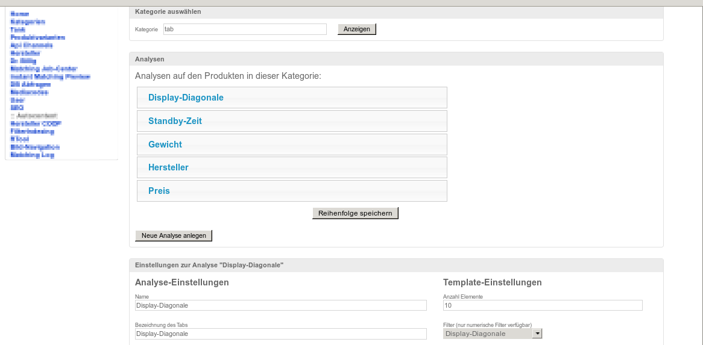
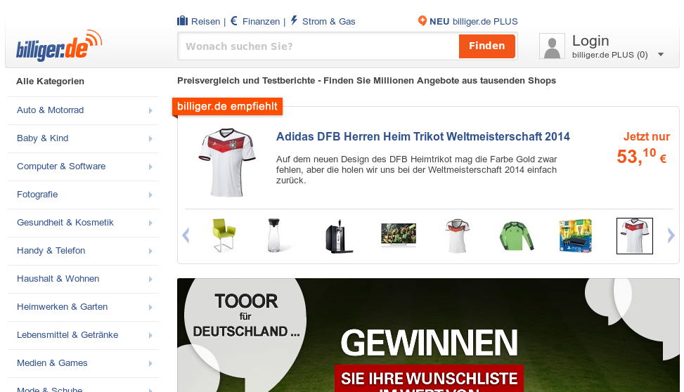

====================
Introducing the EPFL
====================

----------
When EPFL?
----------

The **E**\ PFL **P**\ ython **F**\ rontend **L**\ ogic is a framework for creating web applications.
EPFL is very specialized on **form based** web applications.

So it very suitable for something like this:

But not for this:

Because of it's design and the "server-side-state"-feature the number of concurrent sessions is directly related to it's memory usage. (Maybe 10k per session and 8h-24h session TTL) So again, an edit-frontend for company wide data is it's strength, a website accessible for everybody from the internet maybe not.

---------
Why EPFL?
---------

EPFL stands for EPFL Python Frontend Logic. It is the attempt to ease the pain of business application development. Implementing Data-Models (in terms of MVC) is very well addressed these days, there are a remarkable number of libraries helping to tame databases and thier data in a number of ways. But when it comes to creating nice and usable user interfaces, there are some gaps to fill. On the browser-end you have fancy javascript-libraries to make rich GUIs, but the glue between the model and the view is up to you! And that glue is not a piece of cake! It is the EPFL!

-------------
What is EPFL?
-------------

The EPFL provides you a server-side-only programming experience and structures your application-UI into pages and components. Components can interact - even across pages. It provides a number of base components like table, tree, form that you can customize and use in your application.

The EPFL is written as pyramid extension and released under the repoze (http://repoze.org/license.html) license.

The key ideas are:

- batteries included! (a rich set of components and features you really need)
    - provide a set of reusable components -> speed up development
- fewer options, or: one way to do it right(tm)!
    - give flexibility - but only where needed
- few building blocks (pages and components)
- locality
    - aspects of the application should not be spread over multiple locations -> easy to understand and find functionality
- event driven programming model
- server side state (every user input is available anytime on the server)
- no javascript coding necessary

